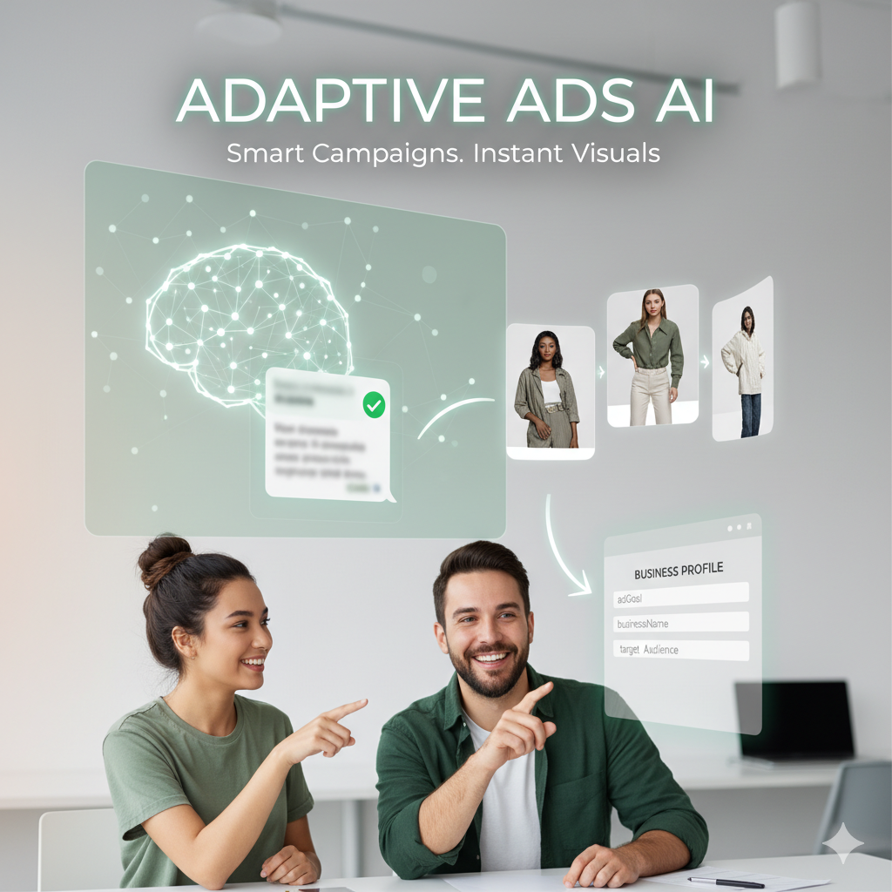
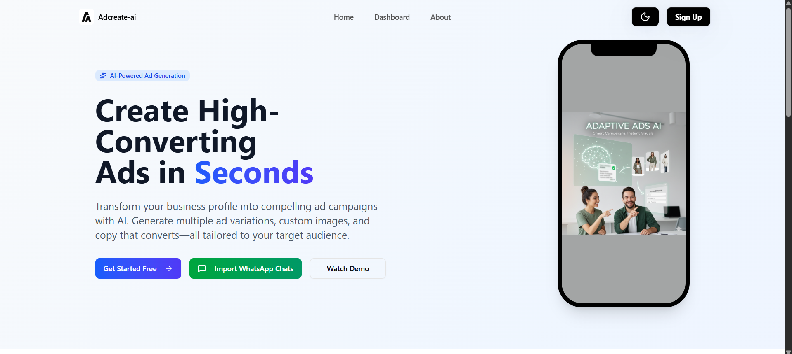
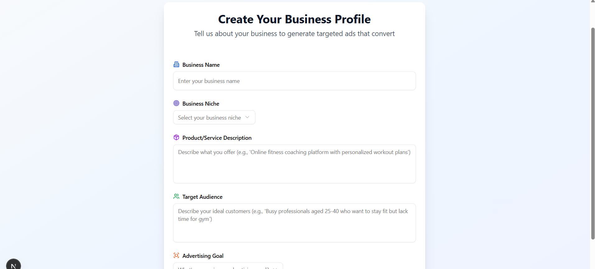
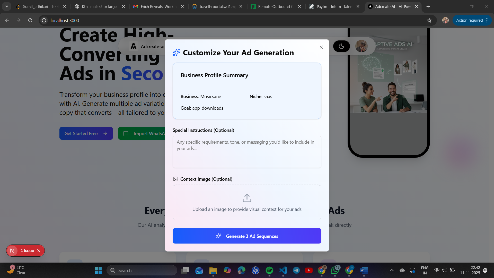
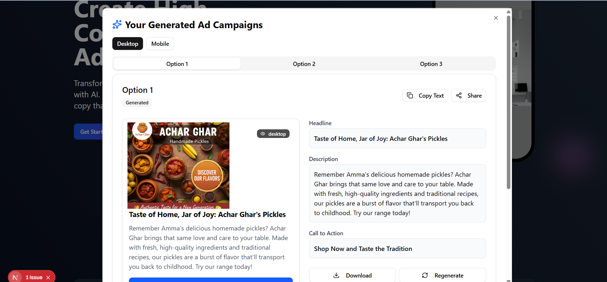

# AdCreate-AI



**AdCreate-AI** is an AI-powered platform that allows businesses to create high-converting ads in seconds. Transform your business profile into multiple ad variations with custom copy and AI-generated images tailored to your target audience.

---
# Live
[Live](https://adcreate-ai.vercel.app)

## Features

* **AI-Powered Ad Generation**: Generate multiple ad variations automatically.
* **Custom Images**: AI-generated images tailored to your brand or upload your own.
* **Smart Targeting**: Ads are tailored to your niche and audience.
* **WhatsApp Chat Import**: Create ads directly from your chat data.
* **Multi-step Workflow**: Simple process from profile creation → instructions → generate & download.
* **Dark/Light Mode**: Toggle themes for a personalized experience.
* **Responsive Design**: Works seamlessly on mobile and desktop.

---

## Tech Stack


         
                          

---

## Screenshots

### Landing Page


### Dashboard & Profile


### Ad Customization


### Generated Results


---

## Getting Started

### Prerequisites

* Node.js >= 22.x
* npm or yarn
* MongoDB / PostgreSQL instance
* Gemini API Key

### Installation

```bash
# Clone the repository
git clone https://github.com/yourusername/adcreate-ai.git
cd adcreate-ai

# Install frontend dependencies
cd frontend
npm install

# Install backend dependencies
cd ../backend
npm install
```

### Environment Variables

Create a `.env` file in the backend and frontend directories:

```env
# Backend
PORT=
FRONTEND_URL="YOUR_FRONTEND_URL"
JWT_SECRET=your_jwt_secret
SALT=10

DATABASE_URL=

# Cloudinary
CLOUD_NAME=
API_KEY=
API_SECRET=

# Google OAuth
GOOGLE_CLIENT_ID=
GOOGLE_CLIENT_SECRET=
GOOGLE_REDIRECT_URI=http://localhost:5000/api/v1/auth/google/callback

GEMINI_API_KEY=

# Frontend (Next.js)
NEXT_BACKEND_URL=http://localhost:5000
```

### Running the App

```bash
# Start backend
cd backend
npm run dev

# Start frontend
cd ../frontend
npm run dev
```

The app should now be running at [http://localhost:3000](http://localhost:3000).

---

## Usage

1. Sign up or log in.
2. Create your business profile.
3. Optionally, import WhatsApp chats for ad ideas.
4. Generate AI-powered ads with multiple variations.
5. Download and use ads for campaigns.

---

## Contributing

Contributions are welcome! Please fork the repository and submit a pull request.

---


MIT License © 2025 AdCreate-AI

---
